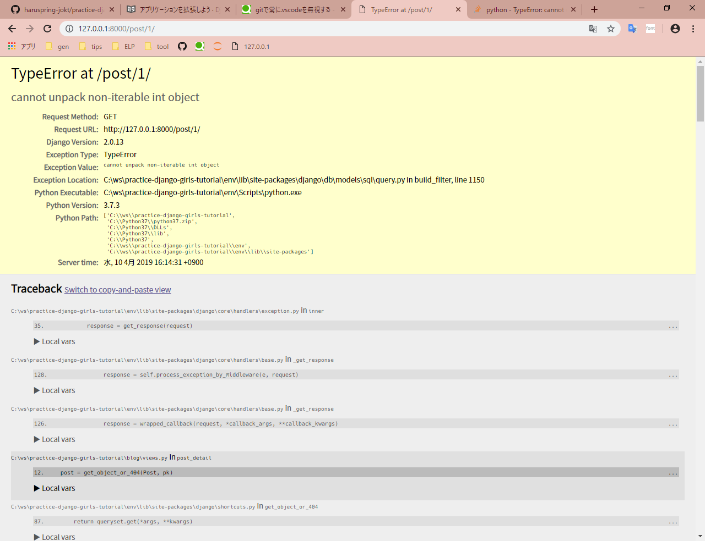
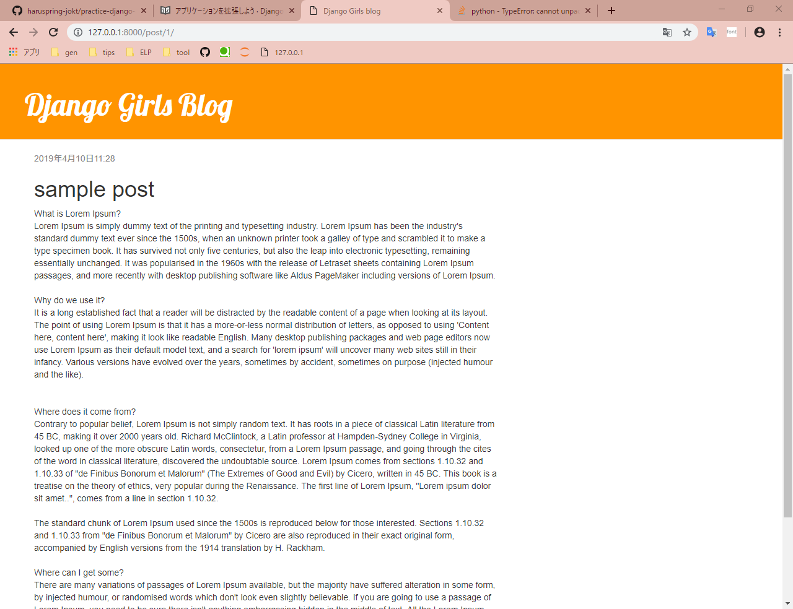

- [version](#version)
- [command](#command)
  - [プロジェクトの作成](#%E3%83%97%E3%83%AD%E3%82%B8%E3%82%A7%E3%82%AF%E3%83%88%E3%81%AE%E4%BD%9C%E6%88%90)
  - [データベースのセットアップ](#%E3%83%87%E3%83%BC%E3%82%BF%E3%83%99%E3%83%BC%E3%82%B9%E3%81%AE%E3%82%BB%E3%83%83%E3%83%88%E3%82%A2%E3%83%83%E3%83%97)
  - [ウェブサーバーの起動](#%E3%82%A6%E3%82%A7%E3%83%96%E3%82%B5%E3%83%BC%E3%83%90%E3%83%BC%E3%81%AE%E8%B5%B7%E5%8B%95)
  - [新しいアプリケーションの作成](#%E6%96%B0%E3%81%97%E3%81%84%E3%82%A2%E3%83%97%E3%83%AA%E3%82%B1%E3%83%BC%E3%82%B7%E3%83%A7%E3%83%B3%E3%81%AE%E4%BD%9C%E6%88%90)
  - [新しいモデルをデータベースに追加する](#%E6%96%B0%E3%81%97%E3%81%84%E3%83%A2%E3%83%87%E3%83%AB%E3%82%92%E3%83%87%E3%83%BC%E3%82%BF%E3%83%99%E3%83%BC%E3%82%B9%E3%81%AB%E8%BF%BD%E5%8A%A0%E3%81%99%E3%82%8B)
  - [superuserの作成](#superuser%E3%81%AE%E4%BD%9C%E6%88%90)
  - [Django shell の起動](#django-shell-%E3%81%AE%E8%B5%B7%E5%8B%95)
- [遭遇したエラーと対処](#%E9%81%AD%E9%81%87%E3%81%97%E3%81%9F%E3%82%A8%E3%83%A9%E3%83%BC%E3%81%A8%E5%AF%BE%E5%87%A6)
  - [views.py内でTypeErrorの発生](#viewspy%E5%86%85%E3%81%A7typeerror%E3%81%AE%E7%99%BA%E7%94%9F)
- [やってないこと](#%E3%82%84%E3%81%A3%E3%81%A6%E3%81%AA%E3%81%84%E3%81%93%E3%81%A8)

## version

```powershell
Django~=2.0.6
```

## command

### プロジェクトの作成

```powershell
(myvenv) C:\workspace> django-admin.exe startproject {project name} .
```

### データベースのセットアップ

```powershell
(myvenv) C:\workspace> python manage.py migrate
```

### ウェブサーバーの起動

```powershell
(myvenv) C:\workspace> python manage.py runserver
```

Windows上で`UnicodeDecodeError`で失敗した場合、代わりに次のコマンドを使用する

```powershell
(myvenv) C:\workspace> python manage.py runserver 0:8000
```

サーバーは`Ctrl+C`で終了する。

### 新しいアプリケーションの作成

```powershell
(myvenv) C:\workspace> python manage.py startapp {application name}
```

### 新しいモデルをデータベースに追加する

以下を実行し移行ファイルを作成する。

```powershell
(myvenv) C:\workspace> python manage.py makemigrations {application name}
```

作成した移行ファイルをデータベースに追加する。

```powershell
(myvenv) C:\workspace> python manage.py migrate {application name}
```

### superuserの作成

```powershell
(myvenv) C:\workspace> python manage.py createsuperuser
```

以下を入力する。

- ユーザー名（必須）
- メールアドレス
- パスワード（8文字以上、`password`などは簡単すぎるのでNGされる）

### Django shell の起動

```powershell
(myvenv) C:\workspace> python manage.py shell
```

## 遭遇したエラーと対処

### views.py内でTypeErrorの発生

[アプリケーションを拡張しよう](https://tutorial.djangogirls.org/ja/extend_your_application/)の章で実装後に`http://127.0.0.1:8000/post/1/`へアクセスすると`TypeError`が発生した。



どうやら`pk`に問題があるっぽい。以下のstack overflowページが参考になった。

[python - TypeError: cannot unpack non-iterable int object in Django views function - Stack Overflow](https://stackoverflow.com/questions/53242684/typeerror-cannot-unpack-non-iterable-int-object-in-django-views-function)

どうやら、`views.py`で`get()`や`filter()`などを使う際は、パラメータの名前を特定するらしい。以下のように変更し、再度アクセスしたところ、無事ページが表示された。どうやら、`id`を指定しないままiterableでないint型の`pk`を渡してしまったのでTypeErrorとなったようだ。

```python
post = get_object_or_404(Post, pk) # 変更前
post = get_object_or_404(Post, id=pk) # 変更後
```



## やってないこと

- [PythonAnywhere](https://www.pythonanywhere.com/)へのデプロイ
